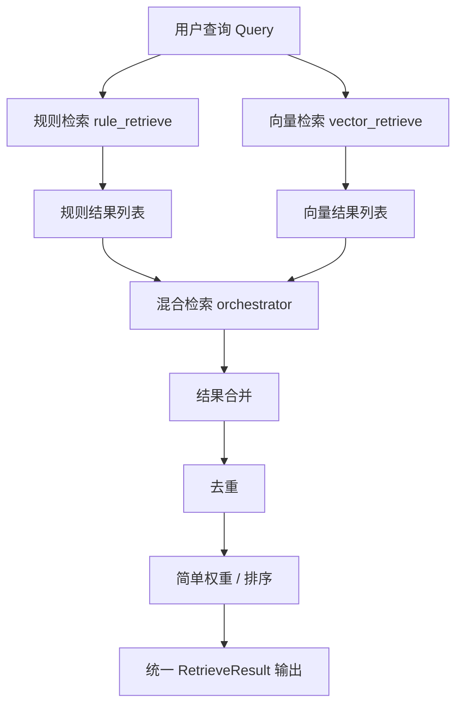

## 【从0到1大模型应用开发实战】04|混合检索

# 前言

在上一篇文章里面，我们已经做了一件很重要的事情：
把规则检索这条最基础的链路跑通了。

但只要你真的写过一点 RAG 项目，就会很快遇到一个现实问题：
真实世界的检索，几乎不可能只靠规则，有很多关键字却没法匹配到具体的文章段落。

有些问题，关键词一命中就该直接返回
有些问题，描述模糊，必须靠语义相似
有些问题，两种方式都不完美，只能组合

所以在这一篇文章我们干了两件事情：

1.引入了向量检索

2.把规则检索和向量检索合并成混合检索


# 步骤

## 1.检索层核心设计原则

在真正动手之前，我们先统一了三条原则。

这三条原则，几乎决定了后面所有文件为什么要拆成现在这样。

第一，检索层不依赖 LLM
第二，检索层不依赖 prompt
第三，每一种检索方式都能独立运行和测试

如果你在写代码时发现：
某个检索函数开始关心模型回复写得好不好
那基本可以确定，结构已经开始走歪了，这篇文章我们也不会


## 2.我们最终得到的目录结构

在这一阶段结束时，我们的目录结构是这样的：

chapter03/
├── index/
│ └── vector_store.py
│
├── retrieve/
│ ├── models.py
│ ├── rule_retrieve.py
│ ├── vector_retrieve.py
│ ├── hybrid_retrieve.py
│
├── documents.py
│
├── ex06_vector_index_query.py
├── ex07_hybrid_retrieve_run.py

这个结构看起来不复杂，但它背后，其实是一整套工程思路。

下面我们按模块，一层一层拆给你看。


## 3.引入向量检索

index 目录里，我们只放了一个文件：vector_store.py。

它只负责三件事：

向量怎么生成
向量怎么存
向量怎么查

它不关心这些向量来自哪里
不关心是规则检索还是语义检索
更不关心最后谁来用这些结果

这样拆的原因很简单：
向量数据库一定会换。

今天你用 Chroma
明天可能用 FAISS
再过一段时间，可能是 Milvus 或 Qdrant

如果你把这些逻辑散落在各个业务文件里，后期基本不可维护。

示例代码位置：

```1:31:examples/rag/chapter03/index/vector_store.py
# rag/index/vector_store.py

from langchain_ollama import OllamaEmbeddings
from langchain_chroma import Chroma
from langchain_core.documents import Document
from typing import List

_COLLECTION_NAME = "rag_v1"

_vectorstore = None

def get_vectorstore(documents: List[Document] | None = None) -> Chroma:
    global _vectorstore

    if _vectorstore is not None:
        return _vectorstore

    embeddings = OllamaEmbeddings(model="nomic-embed-text")

    if documents is None:
        # 后面阶段可以 load 本地持久化
        raise ValueError("First time init requires documents")

    _vectorstore = Chroma.from_documents(
        documents=documents,
        embedding=embeddings,
        collection_name=_COLLECTION_NAME
    )

    return _vectorstore
```


## 4.真正的检索层retrieve

retrieve 目录，是整个文章的主战场，也就是检索的代码存放的地方。

我们没有一上来就写 hybrid，而是先把基础能力拆干净。

### 1. models.py：先定义结构返回的统一结构

很多人一开始会觉得：
不就是返回个 list 吗，何必多此一举。

但我们在这里先定义了 RetrieveResult、HybridItem 这样的结构。

目的只有一个：
统一检索世界的语言。

无论是规则检索
还是向量检索
还是未来的其他检索方式

它们对外说的话，必须是同一种格式。

示例代码位置：

```1:14:examples/rag/chapter03/retrieve/models.py
# rag/retrieve/models.py

from dataclasses import dataclass
from langchain_core.documents import Document
from typing import List, Optional

@dataclass
class HybridRetrieveItem:
    document: Document
    score: float
    sources: List[str]   # ["rule", "vector"]
    rule_score: Optional[float] = None
    vector_score: Optional[float] = None
```


### 2. rule_retrieve：规则检索

在很多 AI 项目里，规则经常被嫌弃。

但在真实业务中：
规则往往更准、更可控、更便宜。

我们把 rule_retrieve 单独做成一个模块，就是在承认一个事实：

不是所有问题都该交给 embedding。

关键词
编号
精确命中

这些场景，用规则反而是最优解。

示例代码位置：

```1:120:examples/rag/chapter03/retrieve/rule_retrieve.py
# rag/retrieve/rule_retrieve.py

from typing import List
from langchain_core.documents import Document
from examples.rag.chapter03.retrieve.models import HybridRetrieveItem
import re


# =========================
# Query 归一化（去噪）
# =========================

def normalize_query(query: str) -> List[str]:
    """
    将自然语言 query 转成高信息密度关键词
    """
    q = query.lower().strip()

    noise_patterns = [
        r"什么是",
        r"请介绍",
        r"介绍一下",
        r"是什么",
        r"如何",
        r"怎么",
        r"吗",
        r"\?",
        r"？",
    ]

    for p in noise_patterns:
        q = re.sub(p, "", q)

    tokens = re.split(r"\s+|，|,|。|；|;", q)

    tokens = [
        t.strip()
        for t in tokens
        if len(t.strip()) >= 2
    ]

    return tokens


# =========================
# 核心规则检索接口
# =========================

def retrieve(
    query: str,
    documents: List[Document],
    top_k: int = 3,
    debug: bool = False
) -> List[HybridRetrieveItem]:
    """
    规则检索（Rule-based Retrieve）

    特点：
    - 纯规则
    - 可解释
    - 不依赖向量 / LLM
    """

    keywords = normalize_query(query)
    results: List[HybridRetrieveItem] = []

    query_lower = query.lower()

    for doc in documents:
        score = 0.0
        hit_rules = []

        content_lower = doc.page_content.lower()
        project = doc.metadata.get("project", "").lower()
        doc_type = doc.metadata.get("doc_type", "")

        # ---------- R1：内容关键词命中 ----------
        for kw in keywords:
            if kw in content_lower:
                score += 3
                hit_rules.append(f"content_hit:{kw}")

        # ---------- R2：项目名命中 ----------
        for kw in keywords:
            if kw in project:
                score += 2
                hit_rules.append(f"project_hit:{kw}")

        # ---------- R3：协议类语义增强 ----------
        if (
            ("协议" in query or "protocol" in query_lower)
            and doc_type == "protocol"
        ):
            score += 2
            hit_rules.append("protocol_match")

        if score > 0:
            results.append(
                HybridRetrieveItem(
                    document=doc,
                    score=float(score),
                    sources=["rule"],
                    rule_score=float(score),
                    vector_score=None
                )
            )

    # ---------- 排序 ----------
    results.sort(key=lambda x: x.score, reverse=True)

    # ---------- Debug 输出 ----------
    if debug:
        print("====== Rule Retrieve Debug ======")
        for r in results:
            print(f"[score={r.score}] sources={r.sources} rule_score={r.rule_score}")
            print(r.document.page_content)
            print("----")

    return results[:top_k]
```


### 3. vector_retrieve：向量检索---把语义能力限制在该出现的地方

vector_retrieve 这个文件，只做语义检索这件事。

它不关心规则是否命中
不关心最后用哪个结果
也不关心排序策略

这种看起来有点笨的拆法，
恰恰是工程里最安全的做法。

示例代码位置：

```1:27:examples/rag/chapter03/retrieve/vector_retrieve.py
from typing import List
from langchain_core.documents import Document
from examples.rag.chapter03.index import get_vectorstore

def vector_retrieve(
    query: str,
    documents: List[Document],
    top_k: int = 3
) -> List[Document]:
    """
    向量召回（V1）

    特点：
    - 只负责"找相似"
    - 不负责业务规则
    - 不做排序策略
    """

    vectorstore = get_vectorstore(documents)

    results = vectorstore.similarity_search(
        query=query,
        k=top_k
    )

    return results
```


项目里面还有一个python文件是用来验证向量检索是不是跑通了，可以用这个来测试

```1:79:examples/rag/chapter03/ex06_vector_index_query.py
from langchain_core.documents import Document
from langchain_ollama import OllamaEmbeddings
from langchain_chroma import Chroma

# =========================
# 1. 准备文档（直接复用你现在的）
# =========================


DOCUMENTS: list[Document] = [
    Document(
        page_content="项目代号：Project Aurora-42。该项目于 2025-12-15 内部启动，目标是为一家中型制造企业构建私有化 AI 知识库系统。",
        metadata={
            "source": "internal_project_record.txt",
            "project": "aurora-42",
            "section": "项目背景",
            "doc_type": "内部项目记录"
        }
    ),
    Document(
        page_content="关键技术选型：后端语言 Python 3.12，LLM 运行方式为 Ollama 本地部署，向量数据库使用 Chroma，框架为 LangChain。",
        metadata={
            "source": "internal_project_record.txt",
            "project": "aurora-42",
            "section": "技术选型",
            "doc_type": "内部项目记录"
        }
    ),
    Document(
        page_content='特殊约定：Aurora-42 项目中，"蓝鲸协议"指的是一种内部定义的数据同步流程，与公开互联网无关。',
        metadata={
            "source": "internal_project_record.txt",
            "project": "Aurora-42",
            "section": "特殊约定",
            "doc_type": "protocol"
        }
    ),
     Document(
        page_content='特殊约定：Burora-52 项目中，"蓝精灵协议"指的是一种内部定义的数据同步流程，与公开互联网无关。',
        metadata={
            "source": "internal_project_record.txt",
            "project": "Burora-52",
            "section": "特殊约定",
            "doc_type": "protocol"
        }
    )
]

# =========================
# 2. 创建 Embedding 模型
# =========================

embeddings = OllamaEmbeddings(
    model="nomic-embed-text"
)

# =========================
# 3. 建立向量数据库（最小示例）
# =========================

vectorstore = Chroma.from_documents(
    documents=DOCUMENTS,
    embedding=embeddings,
    collection_name="demo_protocols"
)

# =========================
# 4. 用自然语言 Query 做相似搜索
# =========================

query = "什么是蓝精灵协议？"

results = vectorstore.similarity_search(query, k=2)

print("Query:", query)
print("Results:")
for doc in results:
    print("-", doc.page_content)
```


### 4. hybrid_retrieve：混合检索

当规则检索和向量检索都能单独跑通之后，
我们才开始写 hybrid。

这里有一个非常重要的点：

这一阶段的 hybrid，不是智能融合，而是工程融合。

我们做的事情很简单：

多路召回
合并结果
去重
简单加权

它是一个 orchestration 层，而不是决策中枢。

混合检索的整体流程如下：



示例代码位置：

```1:89:examples/rag/chapter03/retrieve/hybrid_retrieve.py
# rag/retrieve/hybrid_retrieve.py

from typing import List
from langchain_core.documents import Document
from examples.rag.chapter03.retrieve.models import HybridRetrieveItem
from examples.rag.chapter03.retrieve.rule_retrieve import retrieve as rule_retrieve
from examples.rag.chapter03.retrieve.vector_retrieve import vector_retrieve


def hybrid_retrieve(
    query: str,
    documents: List[Document],
    top_k_rule: int = 5,
    top_k_vector: int = 5,
    debug: bool = False
) -> List[HybridRetrieveItem]:
    """
    Hybrid Recall：
    - Rule Retrieve
    - Vector Retrieve
    - 合并 + 去重 + 标注来源
    """

    hybrid_map = {}

    # ---------- 1. 规则召回 ----------
    rule_results = rule_retrieve(
        query=query,
        documents=documents,
        top_k=top_k_rule,
        debug=debug
    )

    for r in rule_results:
        key = r.document.page_content
        hybrid_map[key] = HybridRetrieveItem(
            document=r.document,
            score=r.score,
            rule_score=r.score,
            vector_score=None,
            sources=["rule"]
        )

    # ---------- 2. 向量召回 ----------
    vector_results = vector_retrieve(
        query=query,
        documents=documents,
        top_k=top_k_vector
    )

    # vector_retrieve 返回 List[Document]，暂时使用固定分数
    # 后续可以改进为返回带分数的结果
    for doc in vector_results:
        key = doc.page_content
        # 暂时使用固定分数，后续可以从 similarity_search_with_score 获取
        vec_score = 1.0

        if key in hybrid_map:
            item = hybrid_map[key]
            item.vector_score = vec_score
            if "vector" not in item.sources:
                item.sources.append("vector")
            # 简单合并分数（先不纠结公式）
            item.score += vec_score
        else:
            hybrid_map[key] = HybridRetrieveItem(
                document=doc,
                score=vec_score,
                rule_score=None,
                vector_score=vec_score,
                sources=["vector"]
            )

    results = list(hybrid_map.values())

    if debug:
        print("====== Hybrid Recall Result ======")
        for r in results:
            print(
                f"score={r.score:.3f} "
                f"sources={r.sources} "
                f"rule={r.rule_score} "
                f"vector={r.vector_score}"
            )
            print(r.document.page_content)
            print("----")

    return results
```


## 5.documents：将需要测试的文档抽出来单独存放，方便后面测试修改成其他的内容

documents.py 很容易被忽略，但它非常关键。

因为它提前把一个问题隔离了出来：

文档从哪里来
和
文档如何被检索

是两件完全不同的事。

今天你可能用本地文件
明天可能是数据库
后天可能是爬虫或 API

只要检索层不感知这些变化，系统就能稳步演进。

示例代码位置：

```1:45:examples/rag/chapter03/documents.py
# rag/chapter03/documents.py
# 测试用的文档数据，供所有测试文件复用

from typing import List
from langchain_core.documents import Document

DOCUMENTS: List[Document] = [
    Document(
        page_content="项目代号：Project Aurora-42。该项目于 2025-12-15 内部启动，目标是为一家中型制造企业构建私有化 AI 知识库系统。",
        metadata={
            "source": "internal_project_record.txt",
            "project": "aurora-42",
            "section": "项目背景",
            "doc_type": "内部项目记录"
        }
    ),
    Document(
        page_content="关键技术选型：后端语言 Python 3.12，LLM 运行方式为 Ollama 本地部署，向量数据库使用 Chroma，框架为 LangChain。",
        metadata={
            "source": "internal_project_record.txt",
            "project": "aurora-42",
            "section": "技术选型",
            "doc_type": "内部项目记录"
        }
    ),
    Document(
        page_content='特殊约定：Aurora-42 项目中，"蓝鲸协议"指的是一种内部定义的数据同步流程，与公开互联网无关。',
        metadata={
            "source": "internal_project_record.txt",
            "project": "Aurora-42",
            "section": "特殊约定",
            "doc_type": "protocol"
        }
    ),
    Document(
        page_content='特殊约定：Burora-52 项目中，"蓝精灵协议"指的是一种内部定义的数据同步流程，与公开互联网无关。',
        metadata={
            "source": "internal_project_record.txt",
            "project": "Burora-52",
            "section": "特殊约定",
            "doc_type": "protocol"
        }
    )
]
```


## 6.最终运行的文件

最终我们使用 ex07_hybrid_retrieve_run.py运行来测试结果
验证多路召回是否符合预期

这样做的好处是：

每一步是否完成，都可以被清楚地验证
每一层出问题，都能快速定位

示例代码位置：

```1:42:examples/rag/chapter03/ex07_hybrid_retrieve_run.py
# examples/rag/chapter03/ex07_hybrid_retrieve_run.py
# 混合检索运行示例

from examples.rag.chapter03.documents import DOCUMENTS
from examples.rag.chapter03.retrieve.hybrid_retrieve import hybrid_retrieve

def main():
    # 测试查询
    query = "什么是蓝精灵协议？"
    
    print("=" * 60)
    print(f"查询: {query}")
    print("=" * 60)
    print()
    
    # 执行混合检索
    results = hybrid_retrieve(
        query=query,
        documents=DOCUMENTS,
        top_k_rule=5,
        top_k_vector=5,
        debug=True
    )
    
    print()
    print("=" * 60)
    print("最终结果（按综合分数排序）")
    print("=" * 60)
    
    for i, item in enumerate(results, 1):
        print(f"\n[{i}] 分数: {item.score:.2f}")
        print(f"    来源: {item.sources}")
        if item.rule_score is not None:
            print(f"    规则分数: {item.rule_score:.2f}")
        if item.vector_score is not None:
            print(f"    向量分数: {item.vector_score:.2f}")
        print(f"    内容: {item.document.page_content[:100]}...")
        print(f"    项目: {item.document.metadata.get('project', 'N/A')}")

if __name__ == "__main__":
    main()
```


调用示例：

我们可以看到不管是规则还是向量其实都命中了一些文档，然后根据我们的规则和向量的分数进行了排序，最终获取到了TOP-K的数据，最后我们就可以把这些数据给到大模型的上下文里面，这样查询出来的数据就非常准确，在经过大模型的润色就可以达到非常好的效果。


## 总结

到这里基本上检索这块咱们就可以结束了，我们刻意没有：引入 LLM，写 prompt，追求最终回答效果

因为一旦这些进来，结构问题就会被掩盖。

我们更关心的是：
当系统继续变复杂时，这个结构还能不能站得住。

是不是：

一套清晰、可扩展的检索层结构
一组职责边界非常明确的模块
一个可以自然接入 Agent 的地基

下一阶段，我们才会真正让 LLM 登场。
