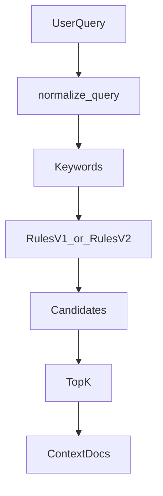

# 从 0 到 1 写一个“可解释”的 RAG 检索器：规则检索 V1 → V2（含可运行代码）

上篇文章我们学习到了基本的Rag原理，用本地的ollama实现了一个非常简易版本的rag流程。

这一篇我们主要来学习下工程化的优化，用来给大模型更加准确的上下文，我们要知道：  
**模型再强，如果某些知识不在模型训练的范围之内，甚至在网络上搜索不到很准确的信息，特别是在企业内部有很多文档和信息是网络上没有的，那么直接问大模型，输入上下文不可靠，输出就很难稳定。**

这就是 RAG（Retrieval-Augmented Generation，检索增强生成）在 AI 应用开发里最工程化的价值：  
**把我该给模型什么上下文这件事，从玄学变成可控的检索系统。**

这一篇我们用一个完全可运行的小例子，专注讲清楚RAG里面这个R（检索）的部分：  
如何在没有向量库、没有 embedding 的情况下，先实现一个 **可解释、可控、可迭代** 的“规则检索器”，并展示从 V1 到 V2 的演进思路。虽然没有用到哪些高级组件，但是手写的代码一步步迭代，其实我们更加能明白工程化为什么要做这些事情，为后面引入向量库，做混合检索做了铺垫。

本文代码对应 examples/rag/chapter02/ 下三个文件：

- ex04_rag_retrieve_rule_v1.py：规则检索 V1（基础可用）
- ex05_retrieve_result.py：V2 的结果结构（可解释性）
- ex05_rag_retrieve_rule_v2.py：规则检索 V2（打分 + 命中规则）


## 1. 规则检索：它是什么？适合什么时候用？

在 RAG 里，“检索”并不只有向量检索。我们完全可以先从 **规则检索** 起步。

### 1.1 规则检索 vs 向量检索（我们现在更需要哪个？）

- **规则检索**
  - 优点：可解释、可控、上线快、无依赖（不需要向量库 / embedding）
  - 缺点：覆盖面有限，规则维护成本会上升
  - 适合：内部知识库早期、文档结构清晰、关键词/项目代号明显、需要强可控的场景

- **向量检索**
  - 优点：语义召回强，对同义改写更友好
  - 缺点：解释性弱；需要 embedding、向量库；调参（chunk、topk、阈值）更“工程化”
  - 适合：知识面大、表达多样、需要更强召回的场景

**一个很实用的路线**：  
先用规则检索把系统跑起来（保证可控 + 可解释），再逐步引入向量检索补召回，最终形成"混合检索"。RAG里面的R就是在用各种方式来提高检索的质量，一个是找到更多可能的信息，第二个是在可能的信息里面找到最相关的一些信息。下面的多个规则来检索就是为了找到更多的信息，保证不会漏掉有用的信息，然后里面的给信息打分就是为了找到最相关最匹配的文段。

### 1.2 规则检索 vs 搜索引擎（技术思路很相似）

我们在举一个例子和我们平常用到非常多的浏览器搜索一样，如果你熟悉搜索引擎的工作原理，会发现规则检索的思路其实很相似：

- **查询预处理**：搜索引擎会分词、去停用词、拼写纠错；我们的 normalize_query 也是去噪声词、提取关键词
- **关键词匹配**：搜索引擎用倒排索引（关键词 → 文档列表）；我们直接在 page_content 中匹配关键词
- **评分排序**：搜索引擎用 TF-IDF、BM25 等综合评分；我们的 V2 用 score 机制（内容命中+3、项目名+2 等）
- **过滤机制**：搜索引擎按时间、类型、站点过滤；我们按 metadata（项目、类型、权限）过滤
- **可解释性**：搜索引擎会高亮匹配词；我们的 V2 用 hit_rules 记录命中原因

**核心区别**：
- 搜索引擎面向全网（亿级数据），目标是"找到相关网页，用户自己阅读"
- RAG 规则检索面向企业内部知识库（千到万级），目标是"找到精确文档，给 LLM 做上下文"

所以 RAG 检索对**精确性**要求更高（宁可少召回，也不能误导 LLM），而搜索引擎更注重**召回率**（宁可多召回，让用户自己筛选）。

---

## 2. 这三个文件在做什么（先建立整体视角）

它们合起来的目标很简单：
给定用户 query，从一组 Document 里挑出最相关的 top_k 条。

我们可以把它理解成一个最小 RAG 检索模块：



在代码里我们用 langchain_core.documents.Document 来承载文档内容与元数据（page_content + metadata），而不是自己在造一个对象，是为了以后无缝接入 LangChain 的后续链路。

---

## 3. V1：能跑起来的规则检索（ex04_rag_retrieve_rule_v1.py）

V1 的关键词：**简单、直观、可运行**。  
它做了两件关键事：

1. 把 query 做"降噪"，变成高信息密度关键词（normalize_query）
注：这一步其实非常重要，如果我们把这个步骤去掉，在我们使用纯规则去匹配的情况下，比如只用了关键词，然后问题是“什么是蓝精灵协议”，这个就匹配不出来。或者用户的问题有很多的没用信息“今天我吃了三个冰淇淋，两个水果，告诉我什么是蓝精灵协议？” 这也很令人头痛，用户带了很多没用的信息，甚至比要检索的东西还多，这个在真实场景里面是极有可能发生的。所以需要做降噪，去掉无用的信息（就是噪声），我们这里主要是为了方便演示，所以只做了简单的规则，去掉"什么是？"，“请介绍”等简单的词语，你只要明白要有个处理的过程就行，具体真正的生产场景比这个复杂太多。


2. 按一组规则筛选 Document，并返回 top_k（retrieve）

### 3.1 Query 降噪：把自然语言变成“关键词”

V1 的 normalize_query 用非常朴素但有效的方法：

- 去掉“什么是/请介绍/吗/？”等口水词
- 按空格和标点切分
- 去掉过短的 token

核心片段（与源码一致，做了缩短便于阅读）：

```python
def normalize_query(query: str) -> List[str]:
    q = query.lower().strip()
    noise_patterns = [r"什么是", r"请介绍", r"介绍一下", r"是什么", r"如何", r"怎么", r"吗", r"\?", r"？"]
    for p in noise_patterns:
        q = re.sub(p, "", q)
    tokens = re.split(r"\s+|，|,|。|；|;", q)
    tokens = [t.strip() for t in tokens if len(t.strip()) >= 2]
    return tokens
```

我们会发现：这一步不"智能"，但它是 **工程上最划算的第一步**。  
因为它把后续规则命中率显著提高，同时可解释、可调。

### 3.2 V1 的五层规则（从强到弱）

V1 的 retrieve 里，规则是分层的（非常重要）：

1. **强规则短路**：项目名直命中（如 aurora-42）就直接返回（保证"我问项目就一定拿到项目文档"）
2. **关键词命中**：任何关键词出现在正文，就收集为候选
3. **metadata 过滤**：例如问"协议"就只保留 doc_type == protocol
4. **去重**
5. **TopK 截断**

我们可以把它当成一条"可控管道"，每一步都能解释。

### 3.3 运行 V1

在项目根目录执行：

```bash
python examples/rag/chapter02/ex04_rag_retrieve_rule_v1.py
```

我们会看到每个 query 返回的 Document 列表。  
这就是最小可用的规则检索器：不花哨，但能把检索这件事落地。

---

## 4. V2：加入打分与可解释性（ex05_retrieve_result.py + ex05_rag_retrieve_rule_v2.py）

V1 的问题是：
命中了就是命中，但“谁更相关”缺少排序依据；也很难解释“为什么命中”。虽然反复执行得到的结果是一样的，但是你没法解释，哪一条应该是放到最前面，最可能是用户想问的。那么咱们就升级到V2版本。

V2 的升级目标很明确：

1. 每个候选文档都有一个 **score**
2. 每个候选文档记录 **命中规则 hit_rules**（解释性）
3. 最后按 score 排序，取 top_k

### 4.1 用数据类承载“可解释结果”

ex05_retrieve_result.py 定义了一个非常干净的结构：

```python
from dataclasses import dataclass
from langchain_core.documents import Document
from typing import List

@dataclass
class RetrieveResult:
    document: Document
    score: int
    hit_rules: List[str]
```

这个结构特别关键：  
它把检索结果从 Document 本体里拆开，避免把评分与解释塞进 metadata变得混乱。

### 4.2 V2 的打分规则（工程上最常用的套路）

V2 做了三类规则，并给不同权重：

- **R1：内容关键词命中**（+3）
- **R2：项目名命中**（+2）
- **R3：协议类过滤命中**（+2）

同时把每次命中的规则写进 hit_rules，例如：

- content_hit:蓝精灵协议
- project_hit:aurora-42
- protocol_match

核心逻辑：

```python
def retrieve(query: str, top_k: int = 3) -> List[Document]:
    keywords = normalize_query(query)
    results: List[RetrieveResult] = []

    for doc in DOCUMENTS:
        score = 0
        hit_rules = []

        content_lower = doc.page_content.lower()

        # ---------- R1：内容关键词命中 ----------
        for kw in keywords:
            if kw in content_lower:
                score += 3
                hit_rules.append(f"content_hit:{kw}")

        # ---------- R2：项目名命中 ----------
        project = doc.metadata.get("project", "").lower()
        for kw in keywords:
            if kw in project:
                score += 2
                hit_rules.append(f"project_hit:{kw}")

        # ---------- R3：协议类文档 ----------
        if ("协议" in query or "protocol" in query.lower()) \
           and doc.metadata.get("doc_type") == "protocol":
            score += 2
            hit_rules.append("protocol_match")

        if score > 0:
            results.append(
                RetrieveResult(
                    document=doc,
                    score=score,
                    hit_rules=hit_rules
                )
            )

    # ---------- 排序 ----------
    results.sort(key=lambda x: x.score, reverse=True)

    # ---------- DEBUG（强烈建议我们保留） ----------
    for r in results:
        print(f"[score={r.score}] rules={r.hit_rules}")
        print(r.document.page_content)
        print("----")

    return [r.document for r in results[:top_k]]
```

### 4.3 为什么 V2 更“能上线”？

因为它解决了 RAG 检索工程化的两大痛点：

- **排序可控**：我们可以通过权重调节"更相关"的定义
- **解释可追踪**：线上出现 badcase，可以快速定位规则与权重

此外，V2 还保留了非常建议我们保留的 DEBUG 输出：

```python
for r in results:
    print(f"[score={r.score}] rules={r.hit_rules}")
```


### 4.4 运行 V2

在项目根目录执行：

```bash
python examples/rag/chapter02/ex05_rag_retrieve_rule_v2.py
```

我们会看到每条候选文档的 score 与 hit_rules，从而直观看到"为什么它排在前面"。

---

## 5. 展示建议：生产场景一般怎么“定义规则”？

下面给一套更贴近生产的规则定义方式（不讲概念，直接给方法）。核心原则：**从强到弱**、**可解释**、**可开关**、**可回滚**。

### 5.1 先定义“强规则”（必须命中、允许短路）

强规则通常来自业务里的“唯一标识”，命中就直接返回（或强加分）：

- **ID/编号类**：项目代号（aurora-42）、工单号、合同号、设备编号、产品型号
- **专有名词类**：协议名、系统名、模块名、内部缩写
- **固定问法类**：例如“某某项目启动时间”“某某协议定义是什么”

落地建议：

- **先做抽取**：用正则/词典把这些标识从 query 里抽出来（类似 V1 的 normalize_query，但更“业务化”）
- **做索引**：把文档按 project/doc_type/version/owner 等 metadata 建索引，强规则命中直接从索引取候选

### 5.2 再定义“加分规则”（决定排序）

把“相关性”拆成多条可加权的信号，并记录到 hit_rules（类似 V2 的做法）：

- **内容命中**：关键词出现在 page_content（可按词频、位置、标题加权）
- **字段命中**：关键词命中 metadata（例如 project、doc_type、tags）
- **意图匹配**：query 含“协议/流程/报错/部署”等意图词 → 只给对应类型文档加分

落地建议：

- **所有加分都要可追踪**：像 content_hit:xxx、project_hit:xxx、protocol_match 这样记录命中原因
- **权重用配置管理**：把 +3/+2 做成可调参数，便于线上快速调优

### 5.3 最后定义“过滤规则”（做安全与边界）

过滤规则一般用于把“不该给模型看的”或“明显不相关的”剔掉：

- **权限过滤**：按部门/角色/租户过滤（最常见）
- **版本过滤**：只保留最新版本或指定版本（避免旧文档污染）
- **类型过滤**：问"协议"只保留 doc_type == protocol

落地建议：

- **过滤优先级高于加分**：先过滤再排序，避免无权限文档进入候选集
- **每条规则可独立开关**：出问题可以快速回滚（线上非常关键）

---

## 6. 总结：从规则开始，把 RAG 做成工程

这篇我们用 chapter02 的三个文件，实现了一个 **可运行、可解释、可迭代** 的规则检索器，并展示了 V1 → V2 的演进：

- V1：规则管道 + 简单可用
- V2：引入结果结构 + 打分排序 + 命中规则解释

后续我们可以继续往前走两步，就是我后面要写的教程：

1. 用向量检索补召回（embedding + vector store）
2. 做混合检索（规则检索做强约束，向量检索做召回补充）

到这里，我们会真正把"AI 应用开发"从调用模型，走向可控的系统工程。
